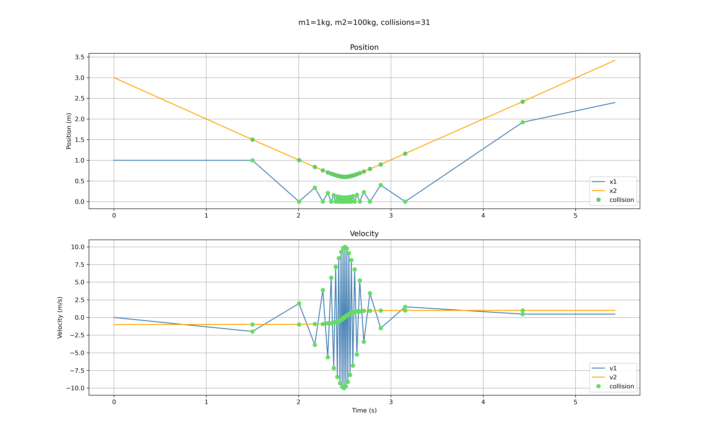

# colliding blocks that compute pi (opencv version)

this is a reproducibility test that use opencv for this blog:

[There's more to those colliding blocks that compute pi](https://www.3blue1brown.com/lessons/colliding-blocks-v2#title)

and rendered video and images are here:

