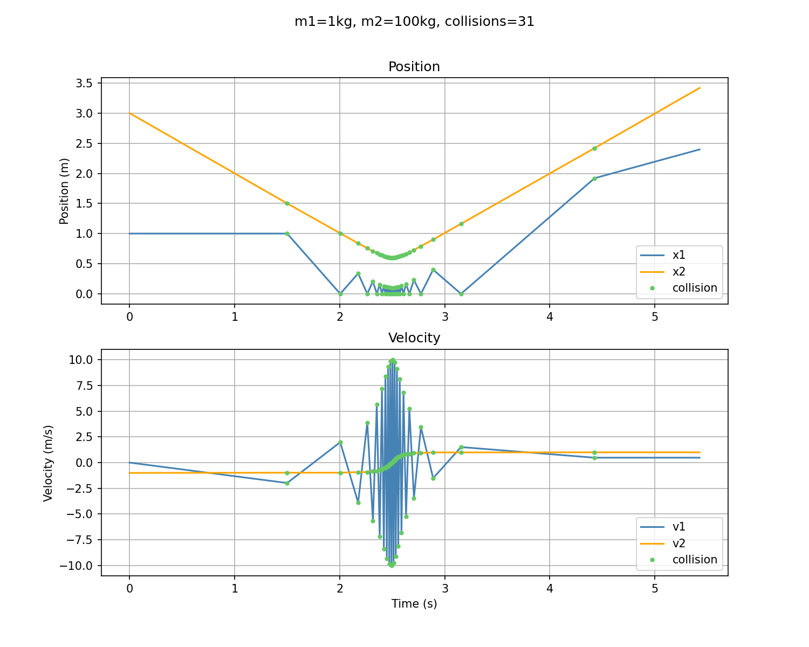

# colliding blocks that compute pi (opencv version)

this is a reproducibility test that use opencv for this blog:

[There's more to those colliding blocks that compute pi](https://www.3blue1brown.com/lessons/colliding-blocks-v2)

and rendered video and images are here:

https://github.com/user-attachments/assets/9d18f1a8-d651-417b-9d2b-75ad92360c16

command line version :

https://github.com/user-attachments/assets/19c57959-5fde-4024-8f71-7b8eb17f0387
